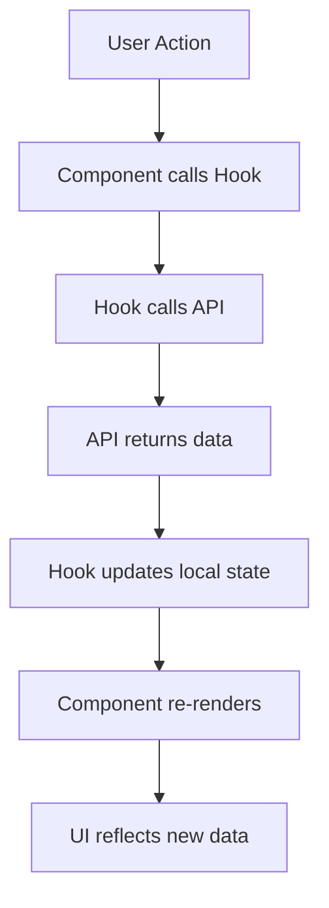

# 🚗⚡ EV Service Center - Mobile App

> **Ứng dụng React Native cho Trung tâm Dịch vụ Xe điện**
>
> Hệ thống quản lý toàn diện với 4 roles: Admin, Member, Staff, Technician

---

## 📑 **Mục lục**

1. [Tổng quan dự án](#-tổng-quan-dự-án)
2. [Công nghệ sử dụng](#-công-nghệ-sử-dụng)
3. [Cấu trúc dự án](#-cấu-trúc-dự-án)
4. [Hệ thống Authentication](#-hệ-thống-authentication)
5. [Routing & Navigation](#-routing--navigation)
6. [API & State Management](#-api--state-management)
7. [UI Components & Theming](#-ui-components--theming)
8. [Role-based Features](#-role-based-features)
9. [Hướng dẫn cài đặt](#-hướng-dẫn-cài-đặt)
10. [Hướng dẫn sử dụng](#-hướng-dẫn-sử-dụng)
11. [Testing Accounts](#-testing-accounts)
12. [Development Workflow](#-development-workflow)

---

## 🎯 **Tổng quan dự án**

### **Mô tả**

EV Service Center là ứng dụng mobile quản lý dịch vụ xe điện với 4 roles chính:

- **Admin**: Quản lý toàn bộ hệ thống, users, inventory
- **Member**: Đặt lịch, theo dõi lịch sử service
- **Staff**: Quản lý lịch làm việc, inventory cơ bản
- **Technician**: Quản lý lịch cá nhân, bằng cấp/chứng chỉ

### **Tính năng chính**

- ✅ Authentication với JWT tokens
- ✅ Role-based access control
- ✅ Real-time API communication
- ✅ Offline-first state management
- ✅ Material Design 3 UI
- ✅ File-based routing với Expo Router

---

## 🛠️ **Công nghệ sử dụng**

### **Frontend Framework**

```json
{
  "react-native": "0.81.4",
  "expo": "~54.0.13",
  "typescript": "~5.9.2"
}
```

### **Navigation & Routing**

```json
{
  "expo-router": "~6.0.11", // File-based routing
  "@react-navigation/native": "^7.1.18",
  "@react-navigation/drawer": "^7.5.10",
  "@react-navigation/stack": "^7.4.10"
}
```

### **UI Framework**

```json
{
  "react-native-paper": "^5.14.5", // Material Design 3
  "@expo/vector-icons": "^15.0.2", // Icons
  "react-native-safe-area-context": "~5.6.0"
}
```

### **State Management**

```json
{
  "zustand": "^5.0.8", // Global state
  "@react-native-async-storage/async-storage": "2.2.0" // Persistence
}
```

### **HTTP Client**

```json
{
  "axios": "^1.12.2", // API calls
  "@tanstack/react-query": "^5.90.2" // Server state (future)
}
```

---

## 📁 **Cấu trúc dự án**

```
fe-mobile/
├── 📱 app/                          # Expo Router - File-based routing
│   ├── _layout.tsx                  # Root layout với theme provider
│   ├── index.tsx                    # Homepage
│   ├── (auth)/                      # Auth group routes
│   │   ├── _layout.tsx              # Auth layout
│   │   ├── login.tsx                # Login screen
│   │   ├── register.tsx             # Register screen
│   │   ├── forgot-password.tsx      # Forgot password
│   │   └── reset-password.tsx       # Reset password
│   ├── admin/                       # Admin role routes
│   │   ├── _layout.tsx              # Admin layout với RoleGate
│   │   ├── index.tsx                # Admin dashboard
│   │   ├── manager-center.tsx       # Management center
│   │   ├── manager-users.tsx        # User management
│   │   ├── manager-inventory.tsx    # Inventory management
│   │   ├── manager-schedule.tsx     # Schedule management
│   │   └── manager-history.tsx      # History management
│   ├── member/                      # Member role routes
│   │   ├── _layout.tsx              # Member layout với RoleGate
│   │   ├── index.tsx                # Member dashboard
│   │   ├── booking.tsx              # Booking screen
│   │   ├── detail.tsx               # Booking details
│   │   ├── history.tsx              # Service history
│   │   └── payment.tsx              # Payment screen
│   ├── staff/                       # Staff role routes
│   │   ├── _layout.tsx              # Staff layout với RoleGate
│   │   ├── index.tsx                # Staff dashboard
│   │   ├── manager-inventory.tsx    # Inventory management
│   │   └── manager-schedule.tsx     # Schedule management
│   └── technician/                  # Technician role routes
│       ├── _layout.tsx              # Technician layout với RoleGate
│       ├── index.tsx                # Technician dashboard
│       ├── degree.tsx               # Degree management
│       └── schedule.tsx             # Schedule management
│
├── 🔧 src/                          # Source code chính
│   ├── 🔐 auth/                     # Authentication components
│   │   └── RoleGate.tsx             # Role-based access control
│   │
│   ├── 🌐 api/                      # API layer
│   │   ├── config.ts                # API configuration
│   │   ├── client.ts                # Axios HTTP client
│   │   ├── interceptors.ts          # Request/Response interceptors
│   │   └── endpoints/               # API endpoints
│   │       ├── auth.api.ts          # Authentication APIs
│   │       ├── users.api.ts         # User management APIs
│   │       ├── booking.api.ts       # Booking APIs
│   │       ├── inventory.api.ts     # Inventory APIs
│   │       ├── schedule.api.ts      # Schedule APIs
│   │       └── payment.api.ts       # Payment APIs
│   │
│   ├── 🎣 features/                 # Business logic hooks
│   │   ├── auth/                    # Authentication hooks
│   │   │   ├── useLogin.ts          # Login hook
│   │   │   └── useMe.ts             # Current user hook
│   │   ├── admin/                   # Admin feature hooks
│   │   │   ├── useUsers.ts          # User management
│   │   │   ├── useUpdateUser.ts     # User updates
│   │   │   └── useInventory.ts      # Inventory management
│   │   ├── member/                  # Member feature hooks
│   │   │   ├── useBookings.ts       # Booking list
│   │   │   ├── useBookingDetail.ts  # Booking details
│   │   │   └── useCreateBooking.ts  # Create booking
│   │   ├── staff/                   # Staff feature hooks
│   │   │   ├── useStaffSchedule.ts  # Staff schedule
│   │   │   └── useStaffInventory.ts # Staff inventory
│   │   └── technician/              # Technician feature hooks
│   │       ├── useTechSchedule.ts   # Technician schedule
│   │       └── useTechDegree.ts     # Degree management
│   │
│   ├── 🗄️ store/                    # Global state management
│   │   ├── authStore.ts             # Authentication store (Zustand)
│   │   └── roleStore.ts             # Role management store
│   │
│   ├── 🧭 navigation/               # Navigation components
│   │   ├── core/                    # Base navigation components
│   │   ├── admin/                   # Admin navigation
│   │   ├── member/                  # Member navigation
│   │   ├── staff/                   # Staff navigation
│   │   └── technician/              # Technician navigation
│   │
│   ├── 🧩 components/               # Reusable components
│   │   ├── themed-text.tsx          # Themed text component
│   │   ├── themed-view.tsx          # Themed view component
│   │   └── ui/                      # UI components
│   │
│   ├── 🎨 theme/                    # Theme configuration
│   │   ├── AppBackground.tsx        # Background component
│   │   └── tokens.ts                # Design tokens
│   │
│   ├── 🪝 hooks/                    # Custom hooks
│   │   ├── use-color-scheme.ts      # Color scheme hook
│   │   └── use-theme-color.ts       # Theme color hook
│   │
│   └── 🛠️ utils/                    # Utility functions
│       ├── constants.ts             # App constants
│       ├── format.ts                # Formatting functions
│       └── http-error.ts            # HTTP error handling
│
├── 🎨 assets/                       # Static assets
│   ├── fonts/                       # Custom fonts
│   ├── icons/                       # App icons
│   └── images/                      # Images
│
├── 📋 Configuration files
├── app.json                         # Expo configuration
├── package.json                     # Dependencies
├── tsconfig.json                    # TypeScript config
└── eslint.config.js                 # ESLint config
```

---

## 🔐 **Hệ thống Authentication**

### **Authentication Flow**

```mermaid
graph TD
    A[User nhập credentials] --> B[useLogin hook]
    B --> C[authApi.login()]
    C --> D{Valid credentials?}
    D -->|Yes| E[Store token + user data]
    D -->|No| F[Show error message]
    E --> G[Navigate to role dashboard]
    G --> H[RoleGate check]
    H --> I[Render protected content]
```

### **1. AuthStore (Zustand)**

**File**: `src/store/authStore.ts`

```typescript
interface AuthState {
  accessToken?: string; // JWT token
  user?: User; // User information
  role?: UserRole; // Current role
  isAuthenticated: boolean; // Auth status
}

interface AuthActions {
  login: (token: string, user: User) => void;
  logout: () => void;
  setToken: (token: string) => void;
  setUser: (user: User) => void;
}
```

**Tính năng**:

- ✅ Persistent storage với AsyncStorage
- ✅ Auto-rehydration khi app restart
- ✅ Type-safe với TypeScript
- ✅ Mock login cho development

### **2. RoleGate Component**

**File**: `src/auth/RoleGate.tsx`

```typescript
interface RoleGateProps {
  requiredRole?: UserRole; // Role yêu cầu
  children: ReactNode; // Content được bảo vệ
}
```

**Logic hoạt động**:

1. **Check authentication**: Nếu chưa login → redirect login
2. **Check role permission**: Nếu role không đúng → redirect dashboard đúng
3. **Render content**: Nếu hợp lệ → hiển thị nội dung

### **3. Login Hook**

**File**: `src/features/auth/useLogin.ts`

```typescript
export interface UseLoginReturn {
  login: (credentials: LoginRequest) => Promise<void>;
  isLoading: boolean;
  error: string | null;
  clearError: () => void;
}
```

**Quy trình login**:

1. Validate input (email format, required fields)
2. Call API với `authApi.login()`
3. Store token + user data vào Zustand
4. Auto-navigate đến dashboard theo role
5. Handle errors với user-friendly messages

---

## 🧭 **Routing & Navigation**

### **Expo Router (File-based)**

Dự án sử dụng **Expo Router** với file-based routing, tương tự Next.js:

```
app/
├── _layout.tsx          → Root layout (/)
├── index.tsx            → Homepage (/)
├── (auth)/              → Auth group
│   ├── login.tsx        → /login
│   └── register.tsx     → /register
├── admin/               → Admin routes
│   ├── index.tsx        → /admin
│   └── manager-users.tsx → /admin/manager-users
└── member/              → Member routes
    ├── index.tsx        → /member
    └── booking.tsx      → /member/booking
```

### **Layout System**

#### **1. Root Layout** (`app/_layout.tsx`)

```typescript
export default function RootLayout() {
  return (
    <PaperProvider theme={paperTheme}>
      {" "}
      {/* Material Design theme */}
      <ThemeProvider>
        {" "}
        {/* React Navigation theme */}
        <Stack>
          {" "}
          {/* Stack navigator */}
          <Stack.Screen name="index" /> {/* Homepage */}
          <Stack.Screen name="(auth)" /> {/* Auth group */}
          <Stack.Screen name="admin" /> {/* Admin routes */}
          <Stack.Screen name="member" /> {/* Member routes */}
          <Stack.Screen name="staff" /> {/* Staff routes */}
          <Stack.Screen name="technician" /> {/* Technician routes */}
        </Stack>
      </ThemeProvider>
    </PaperProvider>
  );
}
```

#### **2. Role-based Layouts**

Mỗi role có layout riêng với RoleGate protection:

**Admin Layout** (`app/admin/_layout.tsx`):

```typescript
export default function AdminLayout() {
  return (
    <RoleGate requiredRole="admin">
      {" "}
      {/* Chỉ admin truy cập */}
      <AppBackground>
        {" "}
        {/* Custom background */}
        <Stack>
          <Stack.Screen name="index" options={{ title: "Admin Dashboard" }} />
          <Stack.Screen
            name="manager-users"
            options={{ title: "Manage Users" }}
          />
          {/* More admin screens */}
        </Stack>
      </AppBackground>
    </RoleGate>
  );
}
```

### **Navigation Patterns**

#### **1. Programmatic Navigation**

```typescript
import { router } from "expo-router";

// Navigate to new screen
router.push("/admin/manager-users");

// Replace current screen (no back button)
router.replace("/admin");

// Go back
router.back();

// Navigate with parameters
router.push({
  pathname: "/member/detail",
  params: { bookingId: "123" },
});
```

#### **2. Link Navigation**

```typescript
import { Link } from "expo-router";

<Link href="/member/booking">
  <Button>Book Service</Button>
</Link>;
```

---

## 🌐 **API & State Management**

### **API Architecture**

#### **1. Configuration** (`src/api/config.ts`)

```typescript
const API_CONFIG = {
  BASE_URL: "https://670d0f30073307b4ee44ca3b.mockapi.io/api/v1",
  TIMEOUT: 10000,
  USE_MOCK_DATA: true, // Toggle mock/real API
  ENABLE_LOGGING: __DEV__,
};
```

#### **2. HTTP Client** (`src/api/client.ts`)

```typescript
export const httpClient = axios.create({
  baseURL: BASE_URL,
  timeout: TIMEOUT,
  headers: {
    "Content-Type": "application/json",
  },
});
```

#### **3. Interceptors** (`src/api/interceptors.ts`)

```typescript
// Request interceptor - add auth token
httpClient.interceptors.request.use((config) => {
  const token = useAuthStore.getState().accessToken;
  if (token) {
    config.headers.Authorization = `Bearer ${token}`;
  }
  return config;
});

// Response interceptor - handle errors
httpClient.interceptors.response.use(
  (response) => response,
  (error) => {
    if (error.response?.status === 401) {
      // Auto logout on 401
      useAuthStore.getState().logout();
      router.replace("/(auth)/login");
    }
    return Promise.reject(error);
  }
);
```

### **API Endpoints Structure**

Mỗi endpoint file chứa:

- **Type definitions**: Request/Response interfaces
- **Mock data**: Cho development
- **API functions**: Actual API calls

**Example**: `src/api/endpoints/auth.api.ts`

```typescript
// Types
export interface LoginRequest {
  email: string;
  password: string;
}

export interface LoginResponse {
  accessToken: string;
  user: User;
}

// Mock data
const MOCK_USERS = [
  { email: "admin@test.com", password: "123456", role: "admin" },
  // ...more users
];

// API functions
export const authApi = {
  login: async (data: LoginRequest): Promise<LoginResponse> => {
    if (USE_MOCK_DATA) {
      // Mock implementation with network delay
      await new Promise((resolve) => setTimeout(resolve, 1000));

      const user = MOCK_USERS.find(
        (u) => u.email === data.email && u.password === data.password
      );

      if (!user) throw new Error("Invalid credentials");

      return {
        accessToken: `mock-token-${user.id}-${Date.now()}`,
        user: { id: user.id, email: user.email, role: user.role },
      };
    }

    // Real API call
    const response = await httpClient.post<LoginResponse>("/auth/login", data);
    return response.data;
  },

  getMe: async (token: string): Promise<User> => {
    // Similar implementation...
  },
};
```

### **Feature Hooks Pattern**

Business logic được tách riêng thành custom hooks trong `src/features/`:

#### **Hook Structure Template**

```typescript
export interface UseFeatureReturn {
  // Data
  data: DataType[];
  isLoading: boolean;
  error: string | null;

  // Actions
  create: (data: CreateRequest) => Promise<DataType>;
  update: (id: string, data: UpdateRequest) => Promise<DataType>;
  delete: (id: string) => Promise<void>;
  refetch: () => Promise<void>;

  // State actions
  clearError: () => void;
}

export const useFeature = (): UseFeatureReturn => {
  const [data, setData] = useState<DataType[]>([]);
  const [isLoading, setIsLoading] = useState(false);
  const [error, setError] = useState<string | null>(null);

  // Implementation...

  return {
    data,
    isLoading,
    error,
    create,
    update,
    delete,
    refetch,
    clearError
  };
};
```

#### **Example Hook**: `src/features/member/useBookings.ts`

```typescript
export const useBookings = (): UseBookingsReturn => {
  const [bookings, setBookings] = useState<Booking[]>([]);
  const [isLoading, setIsLoading] = useState(false);
  const [error, setError] = useState<string | null>(null);

  const fetchBookings = async (): Promise<void> => {
    try {
      setIsLoading(true);
      setError(null);

      const data = await bookingApi.getBookings();
      setBookings(data);
    } catch (err) {
      const httpError = normalizeHttpError(err);
      const errorMessage = getErrorMessage(httpError);

      logError(httpError, "useBookings.fetchBookings");
      setError(errorMessage);
    } finally {
      setIsLoading(false);
    }
  };

  // Auto-fetch on mount
  useEffect(() => {
    fetchBookings();
  }, []);

  return {
    bookings,
    isLoading,
    error,
    refetch: fetchBookings,
    clearError: () => setError(null),
  };
};
```

### **Error Handling System**

**File**: `src/utils/http-error.ts`

```typescript
export interface HttpError {
  message: string;
  status?: number;
  code?: string;
  details?: any;
}

export const normalizeHttpError = (error: any): HttpError => {
  // Normalize different error types
  if (axios.isAxiosError(error)) {
    return {
      message: error.response?.data?.message || error.message,
      status: error.response?.status,
      code: error.code,
    };
  }

  return {
    message: error.message || "Unknown error occurred",
  };
};

export const getErrorMessage = (error: HttpError): string => {
  // Return user-friendly error messages
  switch (error.status) {
    case 401:
      return "Invalid credentials. Please try again.";
    case 403:
      return "Access denied. You do not have permission.";
    case 404:
      return "Resource not found.";
    case 500:
      return "Server error. Please try again later.";
    default:
      return error.message;
  }
};
```

---

## 🎨 **UI Components & Theming**

### **Material Design 3 Theme**

**File**: `app/_layout.tsx`

```typescript
const paperTheme = {
  ...MD3LightTheme,
  colors: {
    ...MD3LightTheme.colors,
    primary: "#2196F3", // Primary blue
    primaryContainer: "#E3F2FD", // Light blue background
    secondary: "#1976D2", // Secondary blue
    surface: "#FFFFFF", // Card background
    background: "#F5F5F5", // App background
  },
};

export default function RootLayout() {
  return <PaperProvider theme={paperTheme}>{/* App content */}</PaperProvider>;
}
```

### **Component Library (React Native Paper)**

#### **Commonly Used Components**

```typescript
import {
  Button, // Material Design buttons
  Card, // Material Design cards
  TextInput, // Material Design inputs
  Title, // Typography - large text
  Paragraph, // Typography - body text
  Divider, // Visual separator
  ActivityIndicator, // Loading spinner
  Snackbar, // Toast notifications
} from "react-native-paper";
```

#### **Example Component Usage**

```typescript
export default function LoginScreen() {
  return (
    <SafeAreaView style={styles.container}>
      <Card style={styles.card}>
        <Card.Content>
          <Title style={styles.title}>Welcome Back</Title>
          <Paragraph style={styles.subtitle}>Sign in to your account</Paragraph>

          <TextInput
            label="Email"
            value={email}
            onChangeText={setEmail}
            mode="outlined"
            keyboardType="email-address"
            style={styles.input}
          />

          <Button
            mode="contained"
            onPress={handleLogin}
            loading={isLoading}
            style={styles.button}
          >
            {isLoading ? "Signing in..." : "Login"}
          </Button>
        </Card.Content>
      </Card>
    </SafeAreaView>
  );
}
```

### **Custom Theme Components**

#### **1. AppBackground** (`src/theme/AppBackground.tsx`)

```typescript
export default function AppBackground({ children }: { children: ReactNode }) {
  return <View style={styles.background}>{children}</View>;
}

const styles = StyleSheet.create({
  background: {
    flex: 1,
    backgroundColor: "#F5F5F5", // Consistent background
  },
});
```

#### **2. ThemedText** (`src/components/themed-text.tsx`)

```typescript
export type ThemedTextProps = TextProps & {
  lightColor?: string;
  darkColor?: string;
  type?: "default" | "title" | "subtitle" | "link";
};

export function ThemedText({ type = "default", ...props }: ThemedTextProps) {
  const color = useThemeColor({ light: lightColor, dark: darkColor }, "text");

  return (
    <Text
      style={[
        { color },
        type === "title" ? styles.title : undefined,
        type === "subtitle" ? styles.subtitle : undefined,
        style,
      ]}
      {...props}
    />
  );
}
```

### **Styling Patterns**

#### **1. StyleSheet Usage**

```typescript
const styles = StyleSheet.create({
  container: {
    flex: 1,
    backgroundColor: "#F5F5F5",
  },
  content: {
    flex: 1,
    padding: 20,
  },
  card: {
    backgroundColor: "#FFFFFF",
    elevation: 4, // Android shadow
    marginBottom: 16,
  },
  button: {
    marginVertical: 8,
  },
  buttonContent: {
    paddingVertical: 8,
  },
});
```

#### **2. Responsive Design**

```typescript
import { Dimensions } from "react-native";

const { width, height } = Dimensions.get("window");

const styles = StyleSheet.create({
  container: {
    width: width > 768 ? "70%" : "100%", // Tablet responsive
    alignSelf: "center",
  },
});
```

---

## 👥 **Role-based Features**

### **🔧 Admin Features**

#### **Pages**:

- **Dashboard** (`/admin`): Tổng quan hệ thống
- **Manager Center** (`/admin/manager-center`): Trung tâm quản lý
- **Manager Users** (`/admin/manager-users`): Quản lý người dùng
- **Manager Inventory** (`/admin/manager-inventory`): Quản lý kho
- **Manager Schedule** (`/admin/manager-schedule`): Quản lý lịch
- **Manager History** (`/admin/manager-history`): Lịch sử hoạt động

#### **Hooks Available**:

```typescript
// User Management
const { users, createUser, updateUser, deleteUser } = useUsers();
const { updateProfile, isUpdating } = useUpdateUser();

// Inventory Management
const { items, createItem, updateItem, deleteItem, getLowStockItems } =
  useInventory();
```

#### **Permissions**:

- ✅ Full CRUD operations trên tất cả resources
- ✅ User management (create, update, delete, activate/deactivate)
- ✅ Inventory management với low stock alerts
- ✅ System-wide reports và analytics

### **👤 Member Features**

#### **Pages**:

- **Dashboard** (`/member`): Member dashboard
- **Booking** (`/member/booking`): Đặt lịch service
- **Detail** (`/member/detail`): Chi tiết booking
- **History** (`/member/history`): Lịch sử service
- **Payment** (`/member/payment`): Thanh toán

#### **Hooks Available**:

```typescript
// Booking Management
const { bookings, isLoading } = useBookings(); // Danh sách booking
const { booking, updateStatus } = useBookingDetail(); // Chi tiết booking
const { createBooking, isCreating } = useCreateBooking(); // Tạo booking mới
```

#### **Permissions**:

- ✅ Xem danh sách services available
- ✅ Tạo booking requests
- ✅ Xem lịch sử bookings của mình
- ✅ Update thông tin cá nhân
- ❌ Không thể xem booking của members khác

### **🏢 Staff Features**

#### **Pages**:

- **Dashboard** (`/staff`): Staff dashboard
- **Manager Inventory** (`/staff/manager-inventory`): Quản lý kho (limited)
- **Manager Schedule** (`/staff/manager-schedule`): Quản lý lịch làm việc

#### **Hooks Available**:

```typescript
// Schedule Management
const { schedules, createSchedule, updateSchedule } = useStaffSchedule();

// Inventory Management (Read + Update quantity only)
const { items, updateItemQuantity, getLowStockItems } = useStaffInventory();
```

#### **Permissions**:

- ✅ Quản lý lịch làm việc của team
- ✅ Cập nhật inventory quantities
- ✅ Xem low stock items
- ❌ Không thể tạo/xóa inventory items
- ❌ Không thể manage users

### **🔧 Technician Features**

#### **Pages**:

- **Dashboard** (`/technician`): Technician dashboard
- **Schedule** (`/technician/schedule`): Lịch làm việc cá nhân
- **Degree** (`/technician/degree`): Quản lý bằng cấp/chứng chỉ

#### **Hooks Available**:

```typescript
// Personal Schedule
const {
  schedules,
  getTodaySchedules,
  getUpcomingSchedules,
  updateAvailability,
} = useTechSchedule();

// Degree & Certification Management
const {
  degrees,
  certifications,
  createDegree,
  createCertification,
  getExpiringCertifications,
} = useTechDegree();
```

#### **Permissions**:

- ✅ Xem và update lịch làm việc cá nhân
- ✅ CRUD bằng cấp và chứng chỉ
- ✅ Track expiring certifications
- ✅ Update availability status
- ❌ Không thể xem lịch của technicians khác

---

## 🚀 **Hướng dẫn cài đặt**

### **Yêu cầu hệ thống**

- **Node.js**: >= 18.0.0
- **npm**: >= 8.0.0 hoặc **yarn**: >= 1.22.0
- **Expo CLI**: Latest version
- **React Native CLI**: Latest version (nếu dùng bare workflow)

### **1. Clone Repository**

```bash
git clone https://github.com/TuancoderLo/EV-Service-Center-SWD.git
cd EV-Service-Center-SWD/fe-mobile
```

### **2. Cài đặt Dependencies**

```bash
# Using npm
npm install

# Or using yarn
yarn install
```

### **3. Install iOS Dependencies (macOS only)**

```bash
cd ios && pod install && cd ..
```

### **4. Environment Setup**

Tạo file `.env` (optional):

```env
# API Configuration
API_BASE_URL=https://your-api-url.com/api/v1
API_TIMEOUT=10000

# Feature Flags
USE_MOCK_DATA=true
ENABLE_LOGGING=true
```

### **5. Start Development Server**

#### **Expo Development Build**

```bash
# Start Metro bundler
npm run start

# Platform specific
npm run android     # Android
npm run ios         # iOS
npm run web         # Web
```

#### **Alternative Development Methods**

```bash
# Using Expo CLI directly
npx expo start

# With specific options
npx expo start --tunnel      # Tunnel mode
npx expo start --localhost   # Localhost only
npx expo start --clear       # Clear cache
```

### **6. Troubleshooting**

#### **Clear Cache**

```bash
# Clear Expo cache
npx expo start --clear

# Clear Metro cache
npx metro-cache clear

# Clear npm cache
npm run reset-project
```

#### **iOS Simulator Issues**

```bash
# Reset iOS Simulator
xcrun simctl erase all

# Rebuild iOS
cd ios && rm -rf build && cd ..
npx expo run:ios
```

#### **Android Issues**

```bash
# Clean Android build
cd android && ./gradlew clean && cd ..
npx expo run:android
```

---

## 📱 **Hướng dẫn sử dụng**

### **1. Lần đầu mở App**

#### **Homepage** (`/`)

- Hiển thị thông tin về EV Service Center
- 2 buttons chính: **Login** và **Register**
- Giới thiệu các services: Vehicle Maintenance, Battery Services, Charging Solutions

#### **Authentication Flow**

**Step 1**: Chọn **Login** từ homepage
**Step 2**: Nhập credentials (xem [Testing Accounts](#-testing-accounts))
**Step 3**: App sẽ auto-redirect đến dashboard theo role

### **2. Role-based Dashboard Usage**

#### **🔧 Admin Dashboard** (`/admin`)

**Tại sao sử dụng**: Quản lý toàn bộ hệ thống

**Workflow thực tế**:

1. **Manager Users**:

   - Xem danh sách tất cả users
   - Tạo account mới cho staff/technician
   - Activate/deactivate accounts
   - Update user permissions

2. **Manager Inventory**:

   - Xem tất cả items trong kho
   - Thêm parts/tools mới
   - Update quantities
   - Monitor low stock items (< 10)
   - Set reorder levels

3. **Manager Schedule**:
   - Tạo schedules cho technicians
   - Assign time slots
   - Monitor workload distribution

**Navigation Pattern**:

```
/admin → Manager Users → Select User → Edit Details → Save
/admin → Manager Inventory → Add New Item → Set Details → Create
```

#### **👤 Member Dashboard** (`/member`)

**Tại sao sử dụng**: Đặt lịch và theo dõi service

**Workflow thực tế**:

1. **Booking Service**:

   - Chọn loại service (Battery Check, Maintenance, etc.)
   - Chọn ngày và giờ available
   - Thêm ghi chú đặc biệt
   - Confirm booking

2. **Track Service**:

   - Xem status: Pending → Confirmed → In Progress → Completed
   - Xem assigned technician
   - View estimated completion time

3. **History**:
   - Xem tất cả bookings đã làm
   - Download invoices
   - Rate service quality

**Navigation Pattern**:

```
/member → Booking → Select Service → Choose Time → Confirm
/member → History → Select Booking → View Details → Download
```

#### **🏢 Staff Dashboard** (`/staff`)

**Tại sao sử dụng**: Quản lý operations hàng ngày

**Workflow thực tế**:

1. **Schedule Management**:

   - Xem lịch làm việc của team
   - Assign technicians to bookings
   - Update time slots
   - Handle schedule conflicts

2. **Inventory Updates**:
   - Update quantities sau khi sử dụng parts
   - Mark items cần reorder
   - Check low stock alerts

**Navigation Pattern**:

```
/staff → Manager Schedule → Today's Schedule → Assign Technician
/staff → Manager Inventory → Update Quantity → Save Changes
```

#### **🔧 Technician Dashboard** (`/technician`)

**Tại sao sử dụng**: Quản lý công việc cá nhân và qualifications

**Workflow thực tế**:

1. **Personal Schedule**:

   - Xem lịch làm việc hôm nay
   - Mark availability/unavailability
   - View assigned bookings
   - Update job completion status

2. **Degree Management**:
   - Add new certifications
   - Update existing degrees
   - Track expiring certificates (auto alert 30 days trước)
   - Upload certificate photos

**Navigation Pattern**:

```
/technician → Schedule → Today → Mark Job Complete
/technician → Degree → Add Certification → Upload Document
```

### **3. Navigation Patterns trong App**

#### **Header Navigation**

- **Back Button**: Luôn có ở top-left để quay lại
- **Title**: Hiển thị tên screen hiện tại
- **Actions**: Logout, Profile (nếu có)

#### **Deep Linking Support**

```typescript
// Direct navigation với params
router.push({
  pathname: "/member/detail",
  params: { bookingId: "123", status: "pending" },
});

// URL-based navigation
router.push("/admin/manager-users?filter=active");
```

#### **Tab vs Stack Navigation**

- **Stack Navigation**: Sử dụng cho all screens (push/pop pattern)
- **No Tab Navigation**: Để focus vào role-specific workflows
- **Drawer Navigation**: Planned for future versions

### **4. Data Flow trong App**

#### **State Management Flow**



#### **Example: Creating a Booking**

1. Member navigates to `/member/booking`
2. Component calls `useCreateBooking()` hook
3. User fills form and clicks "Book Now"
4. Hook validates input và calls `bookingApi.createBooking()`
5. API returns new booking data
6. Hook updates local bookings list
7. Navigate to `/member/detail` với booking ID
8. Success message hiển thị

#### **Error Handling Flow**

1. API call fails (network/server error)
2. `normalizeHttpError()` converts error to standard format
3. `getErrorMessage()` returns user-friendly message
4. Hook sets error state
5. Component hiển thị error UI
6. User có thể retry hoặc clear error

---

## 🔑 **Testing Accounts**

### **Available Test Accounts**

| Role           | Email                 | Password | Description                 |
| -------------- | --------------------- | -------- | --------------------------- |
| **Admin**      | `admin@test.com`      | `123456` | Full system access          |
| **Member**     | `member@test.com`     | `123456` | Customer booking access     |
| **Staff**      | `staff@test.com`      | `123456` | Operations management       |
| **Technician** | `technician@test.com` | `123456` | Personal schedule & degrees |

### **Quick Login Tests**

#### **Test Admin Features**:

```
1. Login với admin@test.com / 123456
2. Auto-redirect đến /admin
3. Try Manager Users → Create new user
4. Try Manager Inventory → Add new item
5. Check low stock alerts
```

#### **Test Member Features**:

```
1. Login với member@test.com / 123456
2. Auto-redirect đến /member
3. Try Booking → Create new booking
4. Check History → View past bookings
5. Try Detail → View booking status
```

#### **Test Role Protection**:

```
1. Login as Member
2. Try access /admin directly
3. Should auto-redirect back to /member
4. RoleGate working correctly
```

#### **Test Authentication**:

```
1. Try access /admin without login
2. Should redirect to /(auth)/login
3. After login, should redirect to appropriate dashboard
4. Logout should clear token và redirect to homepage
```

---

## 🛠️ **Development Workflow**

### **1. Adding New Features**

#### **Step 1: API First**

```typescript
// 1. Add types to API endpoint file
export interface NewFeatureRequest {
  name: string;
  description: string;
}

// 2. Add API function
export const newApi = {
  create: async (data: NewFeatureRequest): Promise<NewFeature> => {
    // Implementation
  },
};
```

#### **Step 2: Create Hook**

```typescript
// 3. Create feature hook
export const useNewFeature = (): UseNewFeatureReturn => {
  // Hook implementation với local state management
};
```

#### **Step 3: Create UI**

```typescript
// 4. Create screen component
export default function NewFeatureScreen() {
  const { data, create, isLoading } = useNewFeature();

  // UI implementation
}
```

#### **Step 4: Add Route**

```typescript
// 5. Add to appropriate role folder
app/admin/new-feature.tsx  // For admin feature
app/member/new-feature.tsx // For member feature
```

#### **Step 5: Update Navigation**

```typescript
// 6. Add to _layout.tsx
<Stack.Screen
  name="new-feature"
  options={{title: "New Feature"}}
/>

// 7. Add navigation button in dashboard
<Button onPress={() => router.push('/admin/new-feature')}>
  New Feature
</Button>
```

### **2. Code Organization Best Practices**

#### **File Naming Convention**

```
PascalCase:     Components (UserCard.tsx)
camelCase:      Hooks (useUserData.ts)
kebab-case:     Routes (user-profile.tsx)
lowercase:      Utils (constants.ts)
```

#### **Import Organization**

```typescript
// 1. React imports
import { useState, useEffect } from "react";

// 2. Third-party libraries
import { router } from "expo-router";
import { Button, Card } from "react-native-paper";

// 3. Internal imports (alphabetical)
import { useAuthStore } from "@/src/store/authStore";
import { normalizeHttpError } from "@/src/utils/http-error";

// 4. Types (if separate file)
import type { User, UserRole } from "./types";
```

#### **Component Structure Template**

```typescript
// 1. Imports
import { ... } from 'react';

// 2. Types (if not in separate file)
interface ComponentProps {
  // props definition
}

// 3. Main component
export default function ComponentName({ ...props }: ComponentProps) {
  // 4. Hooks
  const [state, setState] = useState();
  const { data } = useCustomHook();

  // 5. Handlers
  const handleAction = () => {
    // handler logic
  };

  // 6. Effects
  useEffect(() => {
    // side effects
  }, []);

  // 7. Render
  return (
    <View>
      {/* JSX */}
    </View>
  );
}

// 8. Styles
const styles = StyleSheet.create({
  // styles
});
```

### **3. Debugging Tools**

#### **React Native Debugger**

```bash
# Install Flipper for advanced debugging
npm install -g react-native-flipper

# Enable remote debugging in development
__DEV__ && console.log('Debug info');
```

#### **Network Debugging**

```typescript
// src/api/interceptors.ts already includes request/response logging
if (ENABLE_LOGGING) {
  console.log("API Request:", config);
  console.log("API Response:", response);
}
```

#### **State Debugging**

```typescript
// Zustand devtools (browser only)
const useAuthStore = create<AuthStore>()(
  devtools(persist(/* store implementation */), { name: "auth-store" })
);
```

### **4. Testing Strategy**

#### **Manual Testing Checklist**

```
□ Login flow with all 4 roles
□ Role protection (try access wrong routes)
□ API error handling (disconnect internet)
□ Form validation (empty fields, invalid data)
□ Navigation flow (back buttons, deep links)
□ Offline behavior (data persistence)
□ Loading states (slow network simulation)
```

#### **Future Testing Setup** (Ready to implement)

```typescript
// Unit Testing với Jest
describe("useLogin hook", () => {
  it("should login successfully with valid credentials", async () => {
    // Test implementation
  });
});

// Component Testing với React Native Testing Library
import { render, fireEvent } from "@testing-library/react-native";

test("LoginScreen should show error on invalid credentials", () => {
  // Test implementation
});
```

### **5. Performance Optimization**

#### **Bundle Analysis**

```bash
# Analyze bundle size
npx expo install --fix
npx expo bundle --platform android --dev false --minify false --bundle-output output.bundle

# Check for duplicate dependencies
npm ls --depth=0
```

#### **Code Splitting** (Future enhancement)

```typescript
// Lazy loading components
const AdminScreen = lazy(() => import("./AdminScreen"));

// Lazy loading hooks
const useAdminData = lazy(() => import("./useAdminData"));
```

#### **Memory Management**

```typescript
// Cleanup effects trong hooks
useEffect(() => {
  const subscription = api.subscribe();

  return () => {
    subscription.unsubscribe(); // Cleanup
  };
}, []);
```

### **6. Deployment**

#### **Build for Production**

```bash
# Android APK
npx expo build:android --type apk

# iOS IPA
npx expo build:ios --type archive

# Web build
npx expo export:web
```

#### **Environment Configuration**

```typescript
// src/api/config.ts
const API_CONFIG = {
  BASE_URL: __DEV__
    ? "http://localhost:3000/api/v1" // Development
    : "https://api.production.com/api/v1", // Production

  USE_MOCK_DATA: __DEV__, // Only mock in development
};
```

---

## 🎯 **Next Steps & Future Enhancements**

### **Immediate TODOs**

- [ ] Integrate with real backend API
- [ ] Add push notifications
- [ ] Implement offline sync
- [ ] Add unit/integration tests
- [ ] Add custom drawer navigation

### **Future Features**

- [ ] Real-time chat với technicians
- [ ] Payment integration (Stripe/PayPal)
- [ ] GPS tracking cho service vehicles
- [ ] Photo upload cho service reports
- [ ] Multi-language support (i18n)

### **Performance Improvements**

- [ ] Implement React Query cho server state
- [ ] Add image optimization
- [ ] Bundle size optimization
- [ ] Code splitting cho large features

---

## 💡 **Tips for New Developers**

### **React Native Concepts**

#### **1. Component Lifecycle**

```typescript
// Mount → Update → Unmount
useEffect(() => {
  // Mount: Component did mount
  fetchData();

  return () => {
    // Unmount: Component will unmount
    cleanup();
  };
}, []); // Empty dependency = only run once

// Update: Run when dependencies change
useEffect(() => {
  if (user) {
    updateUserData();
  }
}, [user]); // Run when user changes
```

#### **2. State Management**

```typescript
// Local State - only trong component này
const [count, setCount] = useState(0);

// Global State - share across components
const { user, login } = useAuthStore();

// Server State - data từ API
const { data, isLoading, error } = useBookings();
```

#### **3. Navigation Concepts**

```typescript
// Stack Navigation - push/pop like browser history
router.push("/new-screen"); // Add to stack
router.back(); // Pop from stack
router.replace("/new-screen"); // Replace current screen

// Parameters passing
router.push({
  pathname: "/detail",
  params: { id: "123" }, // Pass data to next screen
});
```

### **Common Patterns**

#### **1. Loading States**

```typescript
function Component() {
  const { data, isLoading, error } = useApiData();

  if (isLoading) return <ActivityIndicator />;
  if (error) return <Text>Error: {error}</Text>;

  return <DataComponent data={data} />;
}
```

#### **2. Form Handling**

```typescript
function FormComponent() {
  const [formData, setFormData] = useState({
    name: "",
    email: "",
  });

  const handleSubmit = async () => {
    try {
      await submitForm(formData);
      router.back(); // Success - go back
    } catch (error) {
      Alert.alert("Error", error.message);
    }
  };

  return (
    <View>
      <TextInput
        value={formData.name}
        onChangeText={(text) =>
          setFormData((prev) => ({
            ...prev,
            name: text,
          }))
        }
      />
      <Button onPress={handleSubmit}>Submit</Button>
    </View>
  );
}
```

#### **3. Error Boundaries**

```typescript
// Always wrap API calls với try-catch
const fetchData = async () => {
  try {
    setIsLoading(true);
    const result = await api.getData();
    setData(result);
  } catch (error) {
    setError(getErrorMessage(error));
  } finally {
    setIsLoading(false);
  }
};
```

### **Debugging Tips**

#### **1. Console Logging**

```typescript
// Debug state changes
useEffect(() => {
  console.log("User changed:", user);
}, [user]);

// Debug API calls
console.log("Calling API with:", requestData);
const response = await api.call(requestData);
console.log("API response:", response);
```

#### **2. React DevTools**

- Install React DevTools extension
- Inspect component props and state
- Track re-renders and performance

#### **3. Network Debugging**

- Use Flipper for network inspection
- Check request/response in Metro logs
- Test offline behavior

---

## 📚 **Tài liệu tham khảo**

### **Official Documentation**

- [React Native](https://reactnative.dev/docs/getting-started)
- [Expo](https://docs.expo.dev/)
- [Expo Router](https://expo.github.io/router/docs/)
- [React Native Paper](https://callstack.github.io/react-native-paper/)
- [Zustand](https://github.com/pmndrs/zustand)

### **Key Libraries Used**

- [Axios](https://axios-http.com/docs/intro) - HTTP client
- [React Navigation](https://reactnavigation.org/) - Navigation
- [AsyncStorage](https://react-native-async-storage.github.io/async-storage/) - Storage
- [TypeScript](https://www.typescriptlang.org/docs/) - Type safety

### **React Native Paper Components**

- [Button](https://callstack.github.io/react-native-paper/button.html)
- [Card](https://callstack.github.io/react-native-paper/card.html)
- [TextInput](https://callstack.github.io/react-native-paper/text-input.html)
- [Typography](https://callstack.github.io/react-native-paper/typography.html)

---

## 🆘 **Hỗ trợ & Troubleshooting**

### **Common Issues**

#### **1. Metro bundler not starting**

```bash
npx expo start --clear
# or
npx metro-cache clear
rm -rf node_modules && npm install
```

#### **2. iOS build issues**

```bash
cd ios && pod install && cd ..
npx expo run:ios --clean
```

#### **3. Android build issues**

```bash
cd android && ./gradlew clean && cd ..
npx expo run:android --clean
```

#### **4. Navigation not working**

- Check if screen is added to `_layout.tsx`
- Verify route path matches file structure
- Ensure RoleGate permissions are correct

#### **5. API calls failing**

- Check network connection
- Verify API endpoint URLs
- Check authentication tokens
- Look at Metro logs for detailed errors

### **Getting Help**

1. **Check Console Logs**: Metro bundler shows detailed error messages
2. **Read Error Messages**: TypeScript errors are usually very specific
3. **Documentation**: Official docs are comprehensive and up-to-date
4. **Community**: Expo Discord, React Native Community forums

---

## 📄 **License & Credits**

### **Project Information**

- **Project Name**: EV Service Center Mobile App
- **Repository**: [EV-Service-Center-SWD](https://github.com/TuancoderLo/EV-Service-Center-SWD)
- **Author**: TuancoderLo
- **Version**: 1.0.0
- **React Native Version**: 0.81.4
- **Expo SDK**: 54.0.13

### **Third-party Libraries**

- React Native Paper (Material Design components)
- Expo Router (File-based routing)
- Zustand (State management)
- Axios (HTTP client)
- React Navigation (Navigation library)

---

**🎉 Chúc bạn develop thành công với EV Service Center App! 🚗⚡**

> **Lưu ý**: README này sẽ được cập nhật liên tục khi dự án phát triển. Hãy check regularly để có thông tin mới nhất!
